> **适用对象**：东北大学秦皇岛分校（NEU Qinhuangdao）在校学生  
> **认证优势**：免费使用 GitHub Pro、JetBrains 全家桶、Azure 学生订阅等价值上千美元的开发者工具

---

## 前言

GitHub Student Developer Pack 为学生提供了丰富的免费开发工具和服务。本指南基于东秦学生的实际申请经验编写，**特别记录了"修改浏览器定位"这一解决认证失败的关键技巧**，希望帮助同学们顺利通过认证。

---

## 东北大学总校学生邮箱的注册与激活

申请 GitHub 学生包需要使用学校提供的教育邮箱。对于东秦学生，我们需要注册并激活东北大学总校的邮箱（后缀为 `@mails.neu.edu.cn`）。

### 前情提要

在操作过程中，如果遇到网站加载缓慢、转圈半天然后报错的情况，这通常是学校网站维护或网络波动，并非您的操作问题。请不要焦躁，稍作休息，等一会儿再回来尝试。

### 1. 进入邮箱系统与初步尝试

首先，请在浏览器中访问东北大学邮件系统：

> <https://mails.neu.edu.cn/coremail/>

在登录框下方找到并点击 **新生注册**。

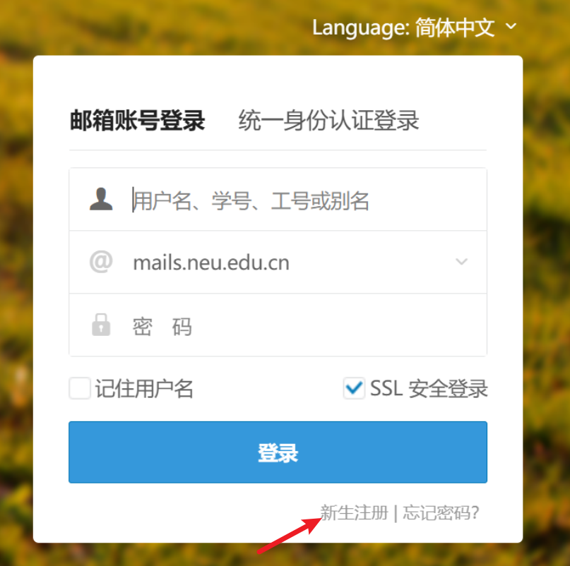

- 注意：无论您是大一新生还是大四老生，只要您之前没有注册过这个邮箱账号，都必须点击“新生注册”入口。

### 2. 统一身份认证与密码重置

点击注册后，系统会跳转到“统一身份认证”界面。由于大多数同学不清楚默认密码或已遗忘，我们需要直接走密码重置流程。

#### 进入重置流程

在登录框下方，点击 **忘记密码**。
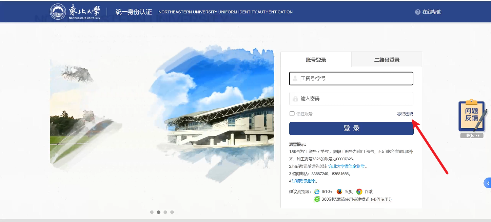

#### 验证账号信息

1. **账号**：输入您的东秦学号（账号是互通的）。
2. **手机**：使用您在东秦校园账号绑定的手机号。
3. 输入图形验证码，点击 **下一步**。
   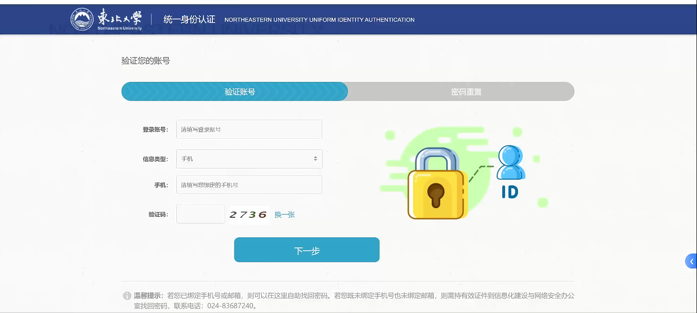

#### 设置新密码

1. 系统会向您的手机发送 6 位动态验证码，填入验证码。
2. 设置一个新的密码（请务必记住，后续登录全靠它）。
3. 点击 **完成**。
   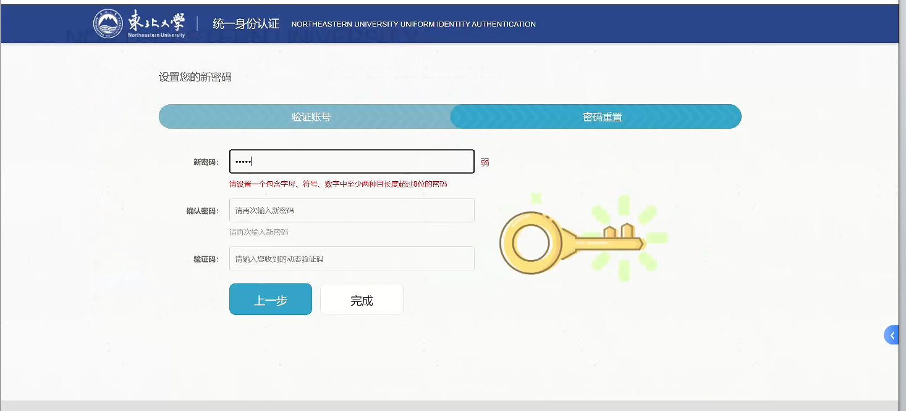

### 3. 二次进入注册流程

密码重置成功后，不要直接登录，我们需要重新走一遍注册入口。

1. 再次回到邮箱系统首页：`https://mails.neu.edu.cn/coremail/`
2. 再次点击 **新生注册**。
   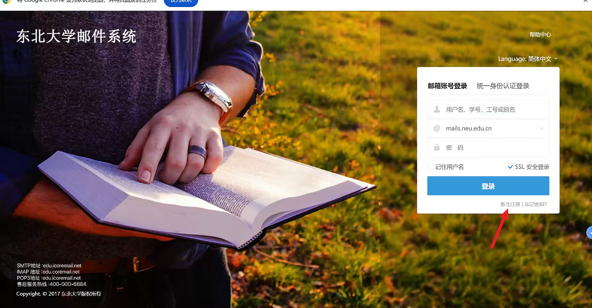
3. 在跳转出的统一身份认证界面，使用您的 **学号** 和 **刚才重置的新密码** 进行登录。
   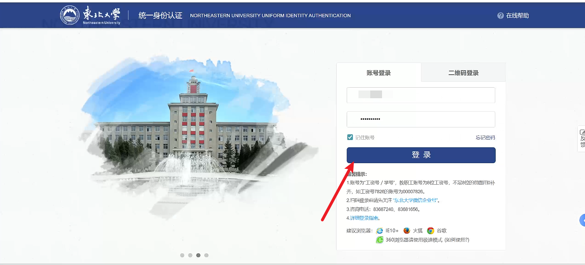
4. 到了绑定邮箱这个界面后,保留这个界面,继续下一步
   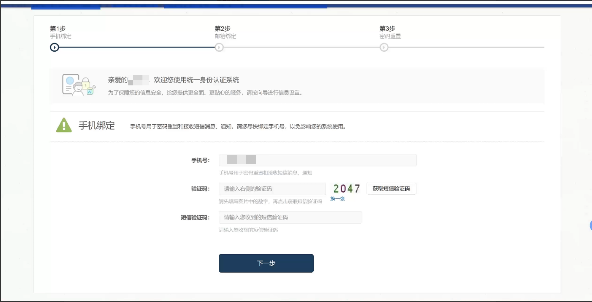

### 4. 第三次进入注册流程

输入网址再回到登录界面,再次点击新生注册

```
https://mails.neu.edu.cn/coremail/
```

<br>
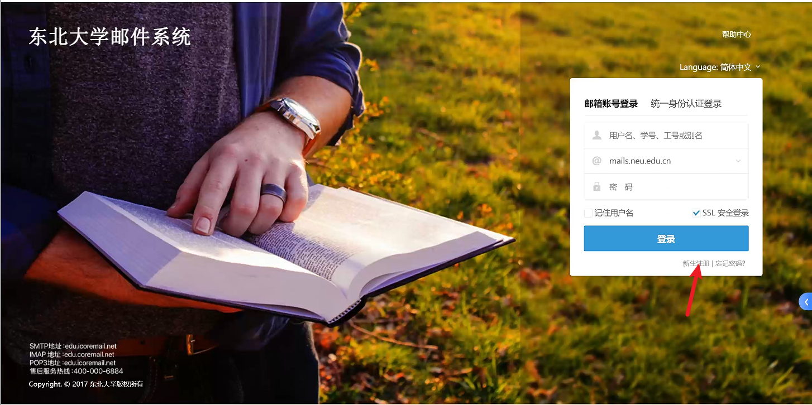

登录成功后，会进入“新生注册”的信息填写页面，请完善以下信息：

- **您的姓名**：确认无误。
- **您的学号**：确认无误。
- **您的邮箱**：设置您的邮箱前缀。
- **邮箱密码**：设置邮箱的独立密码。
- **确认密码**：再次输入。
- **手机号码**：填入手机号并获取验证码。

填写完毕后，点击 **提交信息**。
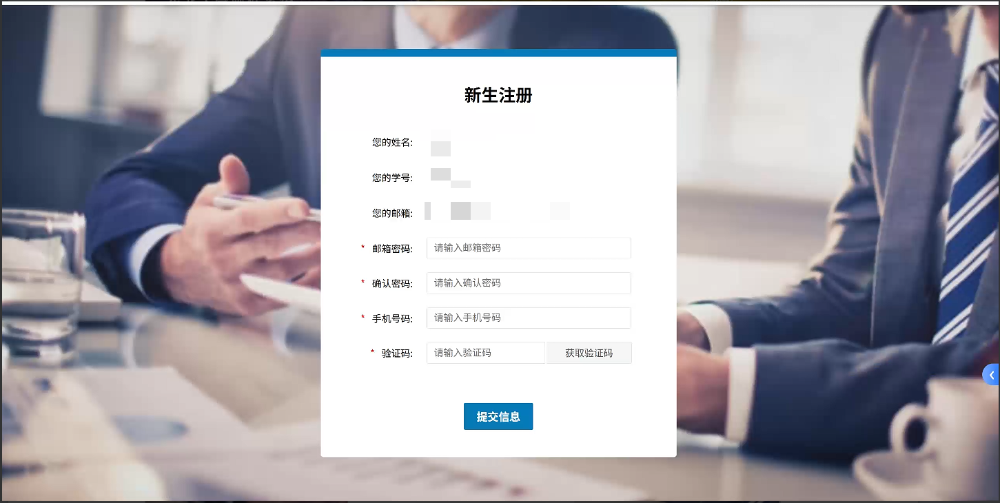

### 5. 登录邮箱（关键避坑点）

注册提交后，可能会遇到一个坑：如果直接使用刚才注册的“邮箱账号+邮箱密码”登录，系统可能会提示失败或进不去（可能是系统适配问题）。

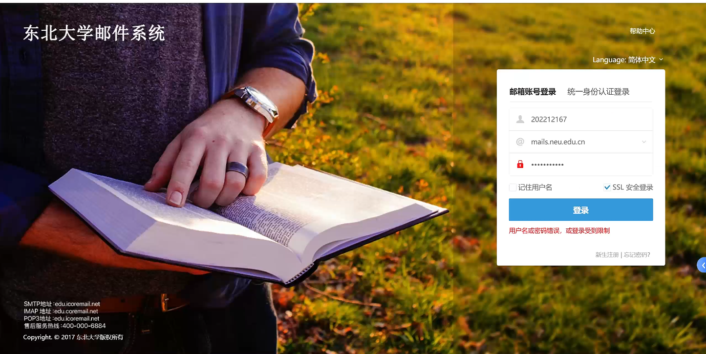

**正确登录方式：**

1. 回到邮箱登录首页。
2. 即使已经注册好了，也不要直接输账号密码。
3. 点击登录框上方的 **统一身份认证登录** 选项卡（或链接）。
4. 使用 **学号** 和 **统一身份认证密码** 进行登录。

成功登录后，您将看到邮箱主界面。请点击左上角头像，确认您的邮箱地址后缀为 `@mails.neu.edu.cn`。至此，教育邮箱准备工作完成
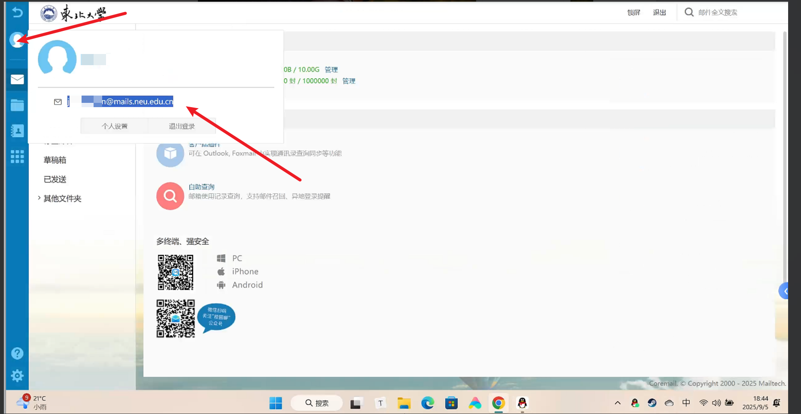

---

## GitHub 账号的标准化配置

拥有了教育邮箱后，我们需要将其绑定到 GitHub 账号上，并完成官方要求的安全设置（2FA）以及个人资料的“学生化”包装。

### 准备工作：网络环境配置

在登录 GitHub 之前，有一个非常重要的细节需要注意。
根据实测经验，建议开启 **Steam++** (Watt Toolkit) 来加速 GitHub。

- **避坑指南**：尽量避免使用其他普通的梯子或代理工具，因为 GitHub 的风控系统可能会检测到 IP 异常，从而影响最终的认证结果。

### 绑定教育邮箱

#### 进入设置页面

1. 访问 GitHub 官网：`https://github.com/`
2. 登录您的 GitHub 账号（如果没有账号请先注册）。
3. 点击右上角的头像，在下拉菜单中选择 **Settings** (设置)。
   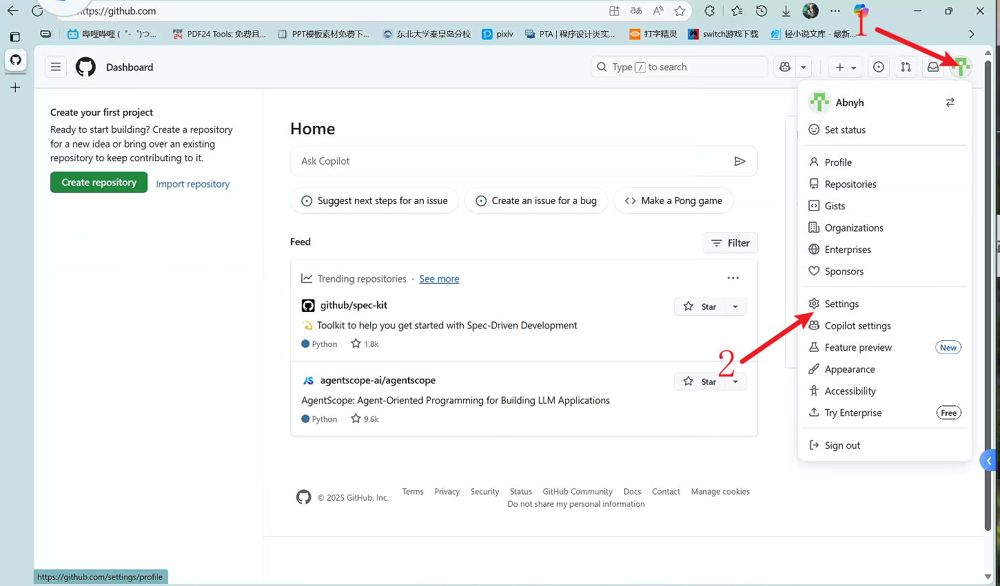

#### 添加邮箱

1. 在左侧菜单栏中找到并点击 **Emails**。
2. 在 "Add email address" 输入框中，填入您在第一章注册好的学生邮箱（例如 `yourname@mails.neu.edu.cn`）。
3. 点击 **Add** 按钮。
4. 之后点击认证一下,GitHub 会向您的学生邮箱发送一封验证邮件。
5. 请登录您的学生邮箱，找到邮件并点击验证链接。
6. 找到 **Keep my email addresses private** 选项。
7. **务必取消勾选**（保持 Off 状态）。如果不关闭这个选项，GitHub 在审核时可能无法读取到您的学生邮箱，导致认证失败。
   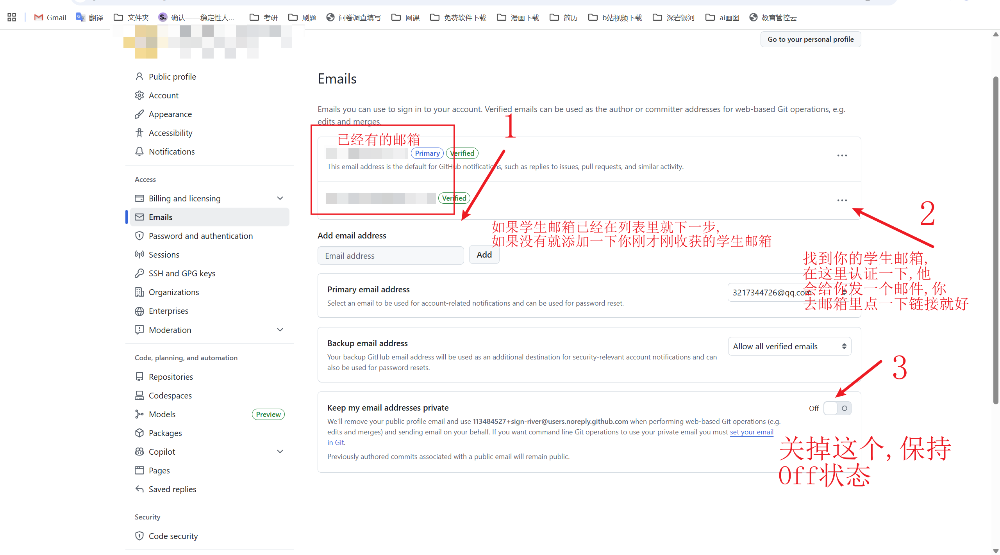

### 开启双重认证 (2FA)

GitHub 现在强制要求开启 2FA (Two-factor authentication) 才能进行某些操作，这也是申请学生包的硬性门槛。

#### 启用入口

1. 在左侧菜单栏点击 **Password and authentication**。
2. 向下滚动找到 "Two-factor authentication" 区域。
3. 点击 **Enable two-factor authentication** 按钮。
   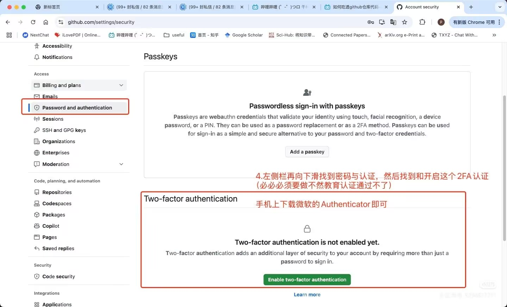

#### 配置身份验证器

1. 页面会显示一个二维码。
2. 请在手机上下载并安装 **Microsoft Authenticator** (或其他类似软件)。
3. 打开手机 App，扫描屏幕上的二维码。
4. App 会生成一个 6 位数的动态验证码，将其填入 GitHub 网页的输入框中。
5. **保存恢复代码**：系统会生成一组 Recovery Codes（恢复代码），请务必下载并妥善保存。如果您丢失了手机或误删了 App，这是找回账号的唯一凭证。
   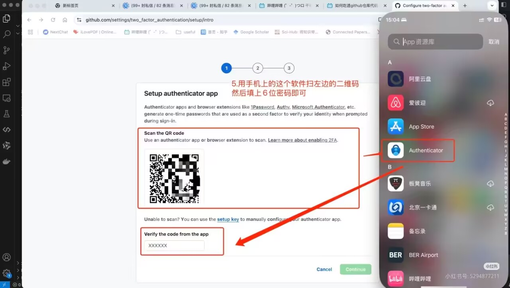

### 完善个人资料 (关键加分项)

为了证明您的“真实学生身份”，我们需要将个人资料修改为符合东秦学生特征的标准格式。

在左侧菜单栏点击 **Public profile**，按照以下标准填写：

#### Name (姓名)

- 格式：**名 姓** (拼音)

- 示例：如果您叫张三丰，请填 **Sanfeng Zhang**。
- 注意：不要填昵称，要填真实姓名的拼音，与学生证/校园卡保持一致。

#### Bio (简介)

- 建议：用英文简单描述一下您的身份。

- 示例：Student from School of Computer Science and Engineering, majoring in Software Engineering.

#### URL (链接)

- 填入东秦官网地址：`https://www.neuq.edu.cn/`

#### Company (学校/机构)

- **必须严格填写东秦的英文全称**：

- 内容：`Northeastern University at Qinhuangdao`
- 注意：不要填简写，也不要只填东北大学总校的名字，要精确到秦皇岛分校。

#### Location (地区)

- 内容：`China`
  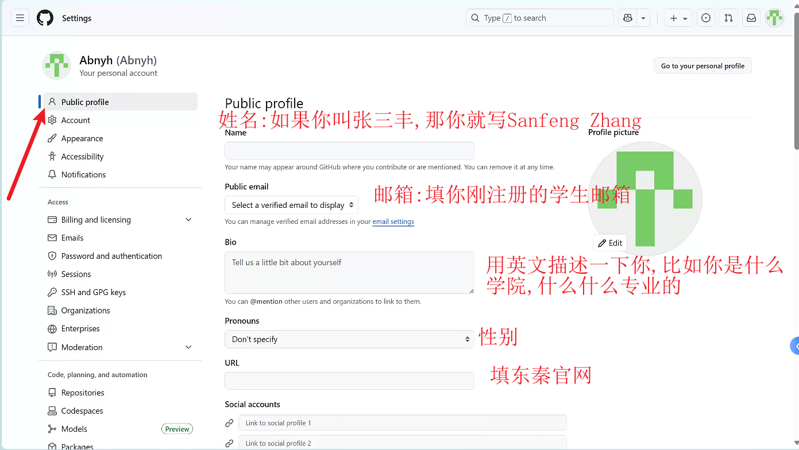
  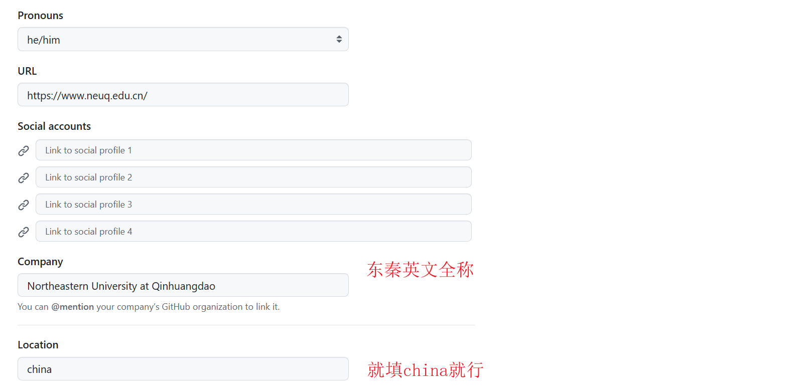

填写完毕后，点击页面底部的 **Update profile** 保存修改

## 完善账单信息

在正式提交学生认证申请之前，我们需要先完善 GitHub 的账单信息（Payment information）。这一步非常关键，因为 GitHub 会校验这里的“名义地址”是否与你的学校所在地（秦皇岛）一致。

### 1. 填写账单信息 (关键)

#### 进入入口

1. 点击 GitHub 页面右上角的头像，选择 Settings。
2. 在左侧菜单栏找到 Access 区域，点击 Billing and licensing。
3. 在展开的子菜单中，点击 Payment information。

#### 填写规范 (请严格照抄)

请参照以下标准进行填写，确保与第二章的个人资料保持高度一致：

- First name / Last name (姓名)
  - 格式：名 姓 (拼音)
  - 示例：如果您叫张三丰，这里填 Sanfeng 后面填 Zhang。
  - 警告：必须填真实姓名的拼音，严禁使用昵称或中文。

- Company (公司/学校)
  - 这里的输入框可能自动同步了个人资料，如果没有，请手动填入：
  - Northeastern University at Qinhuangdao

- Address (街道地址)
  - 内容：Northeastern University at Qinhuangdao
  - 注意：必须填东秦的英文全称。

- City (城市)
  - 内容：Qinhuangdao

- State/Province (省份)
  - 内容：Hebei Province

- Country/Region (国家/地区)
  - 选择：China
    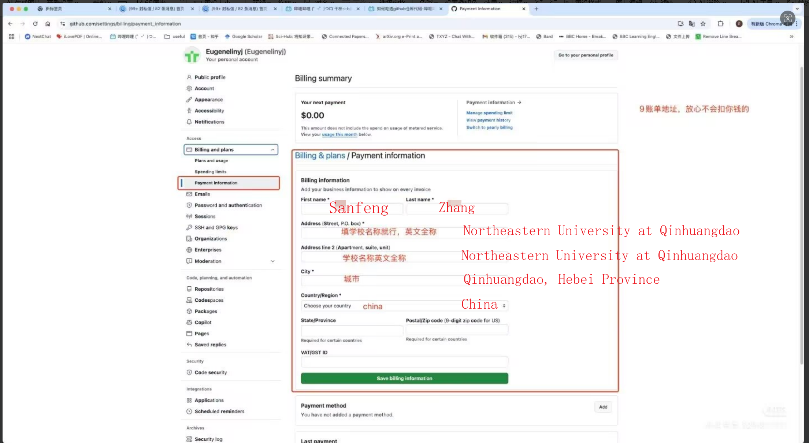

确认所有信息无误后，点击底部的 Save billing information 保存。

## 开始申请流程,解决定位问题与上传凭证（核心章节）

### 进入教育优惠申请入口

#### 找到入口

1. 依然在左侧 Billing and licensing 菜单下。
2. 点击 Education benefits。
3. 在页面右侧找到并找到绿色的 Start an application 按钮,但是先不要点击,先看下一步。
   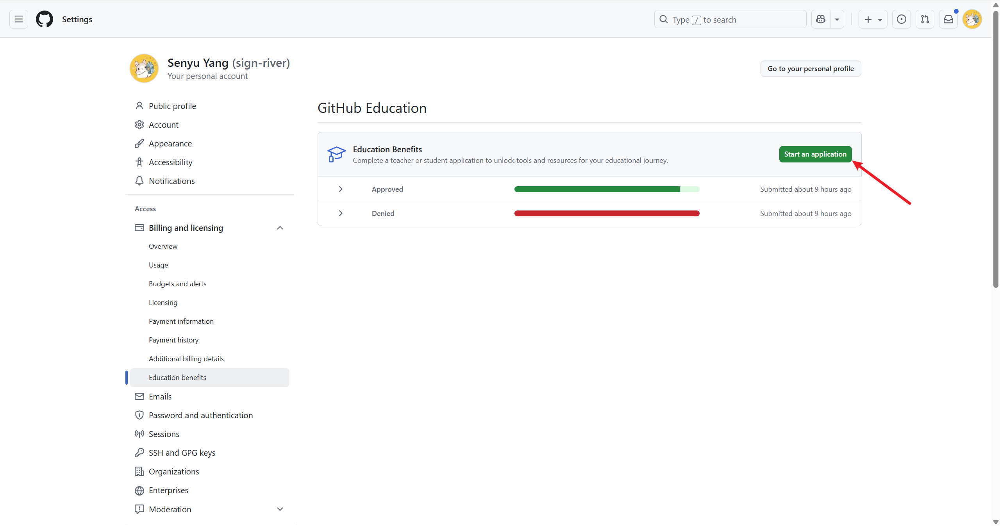

GitHub 会校验您的物理位置是否在学校附近。如果您身处校外（如寒暑假在家），或者校园网定位不准，直接申请很可能导致认证失败。

请务必按照以下“修改浏览器定位”的流程操作：

#### 打开开发者工具

1. 在当前申请页面，按键盘上的 F12 键（打开开发者工具）。
2. 保持开发者工具开启，不要关闭。

#### 调出传感器 (Sensors) 面板

1. 在开发者工具窗口中，先点击顶部的 Network (网络) 选项卡。
2. 点击右上角的 三个点 图标（更多选项）。
3. 在下拉菜单中选择 More tools (更多工具)。
4. 在子菜单中选择 Sensors (传感器)。
5. 此时，界面下方会出现一个 Sensors 面板。
   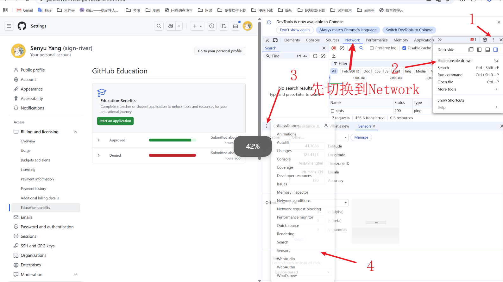

#### 输入东大坐标参数 (严格照抄)

在 Sensors 面板中进行如下设置：

- Location: 在下拉框中选择 Other...
- Latitude (纬度): 输入 41.7636
- Longitude (经度): 输入 123.4113
- Timezone ID: 输入 Asia/Shanghai
- Locale: 输入 zh-Hans-CN
- Accuracy: 输入 150
  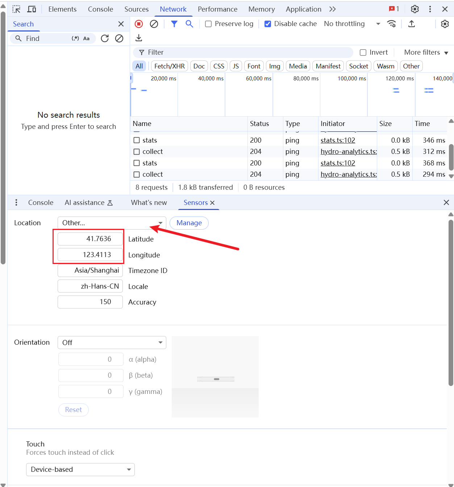

#### 刷新页面生效

1. 保持开发者工具（F12）和 Sensors 面板处于开启状态（这一点非常重要，不能关）。
2. 后续截图虽然没有截入开发者工具面板,但是一定不能关
3. 点击浏览器左上角的 刷新 按钮。
4. 页面刷新后，点击绿色的 Start an application 按钮。
   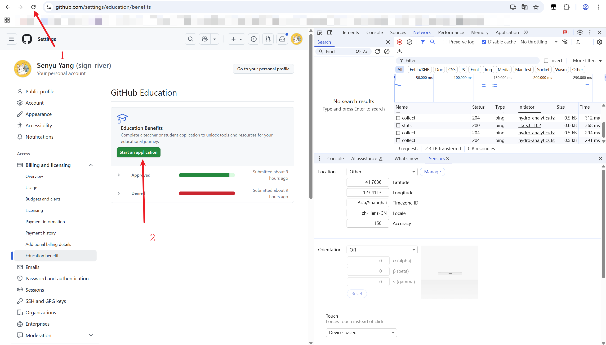

### 确认身份信息

#### 选择角色

- Select your role in education: 选择 Student (学生)。

#### 确认学校关联

- 由于我们在第二章已经绑定了 @mails.neu.edu.cn 的邮箱，系统会自动识别出学校。

- 界面通常会提示：You have verified the email address ... associated with the school Northeastern University, China.
- 此时直接点击 Continue (继续) 即可。
  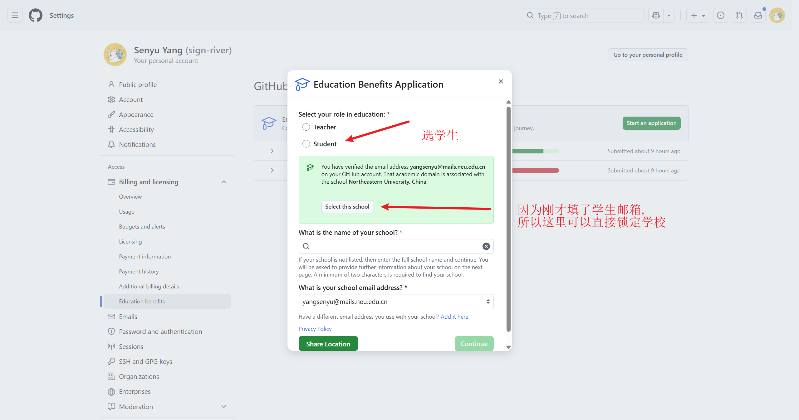

点击 Continue 后，再点击 Share Location（分享定位）。
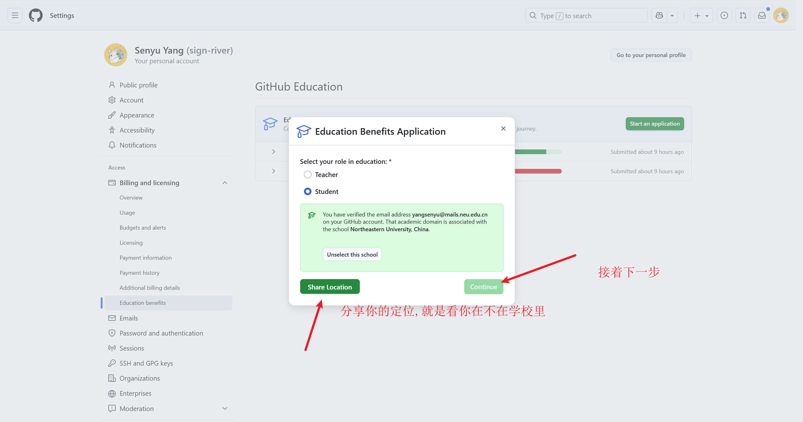

### 上传学生证件

定位通过后，页面下方会出现证件上传区域。

#### 选择凭证类型

在 Please select the type of proof you would like to provide 下拉菜单中，选择：

- 1. Dated school ID - Good (有日期的学生证)
     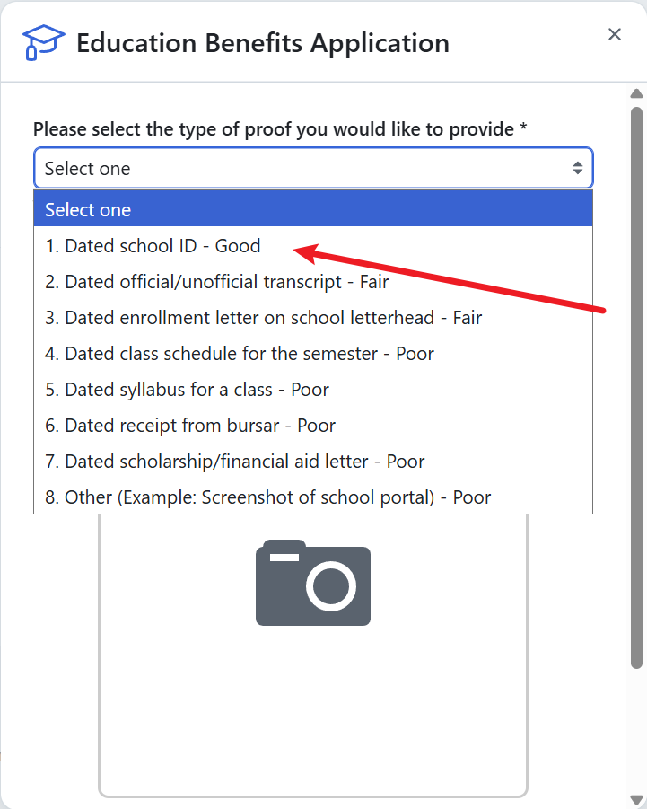

#### 拍照上传

1. 浏览器会请求使用摄像头，请务必点击 允许。
2. 拿出您的 东北大学秦皇岛分校一卡通（校园卡）。
3. 拍摄要求：
   - 拍摄印有 人像照片 的那一面。
   - 确保光线充足，文字清晰可见。
   - 手持卡片对准摄像头（第二次点击通常有 3 秒延迟拍摄）。
   - 亲测饭卡（一卡通）是可行的。

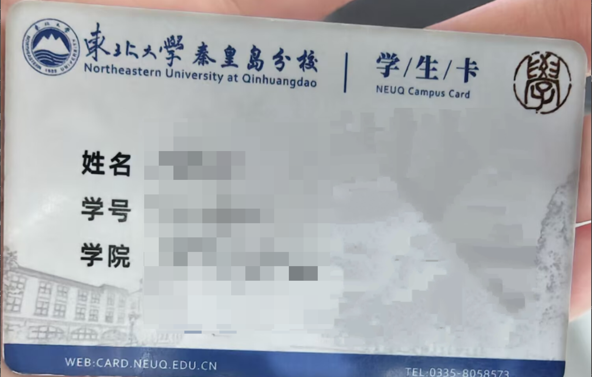

### 提交与审核结果

#### 提交申请

照片上传无误后，点击底部的 Submit 提交申请。

#### 查看审核状态

提交后页面会显示审核状态，一般 3-4 分钟 即可出结果，请刷新页面查看：

- Approved (绿色)：恭喜！认证通过。页面提示福利将在 72 小时内到账。
- Denied (红色)：认证失败。系统会提示具体原因（如图像不清、定位不符等），请根据提示修正后重新尝试。
  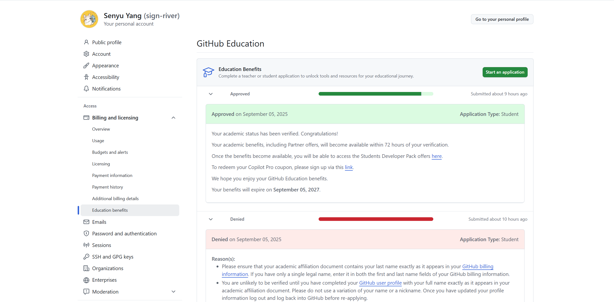

---

## 参考资料

- [GitHub Education 官方网站](https://education.github.com/)
- [GitHub Student Developer Pack 福利列表](https://education.github.com/pack)

---
