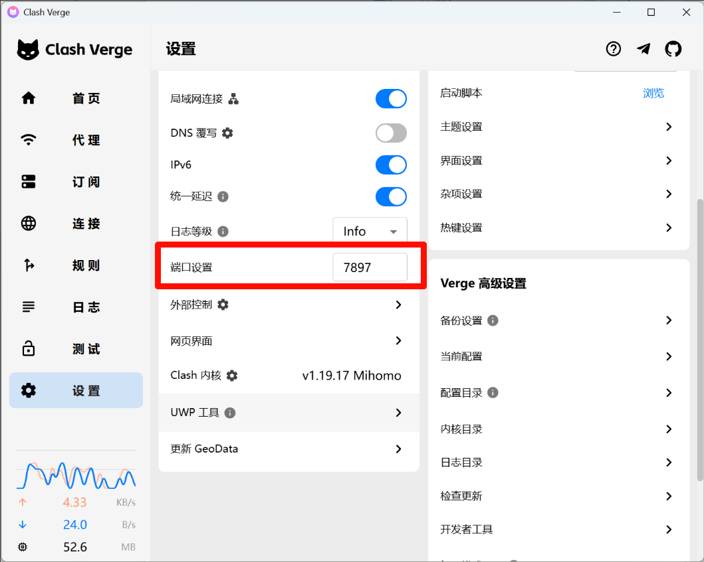
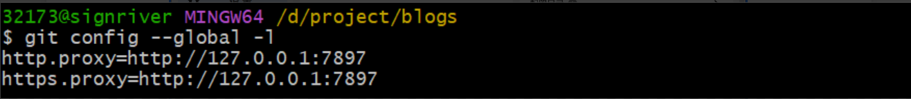

## 1. 问题背景

在新电脑上使用 Git 时，常常会因为缺少必要配置而遇到各种问题：

- 无法连接 GitHub（网络问题）
- 提交代码时提示缺少用户信息
- 中文文件名显示为乱码

本文整理了新机 Git 初始化的完整流程，帮助你快速配置好开发环境。

## 2. 配置代理

如果你需要使用代理工具访问 GitHub，首先需要配置 Git 的网络代理。

### 2.1. 查找代理端口

不同的代理工具使用的端口不同：

- **Clash**：默认端口 `7890`
- **Clash Verge**：默认端口 `7897`
- 其他工具：可在工具的设置中查看
  <a href="images/2026-02-11-11-28-12.png" target="_blank">  </a>

### 2.2. 设置代理

在 Git Bash 或终端中输入以下命令（将 `7897` 替换为你的实际端口）：

```bash
git config --global http.proxy http://127.0.0.1:7897
git config --global https.proxy http://127.0.0.1:7897
```

### 2.3. 验证配置

输入以下命令查看配置是否生效：

```bash
git config --global -l
```

如果看到以下输出，说明代理配置成功：

```
http.proxy=http://127.0.0.1:7897
https.proxy=http://127.0.0.1:7897
```

<br>
 <a href="images/2026-02-11-11-28-50.png" target="_blank">  </a>

## 3. 配置用户信息

Git 在提交代码时需要记录提交者的身份信息。

### 3.1. 设置用户名和邮箱

在引号内填入你的 GitHub 用户名和邮箱（建议使用 GitHub 绑定的邮箱）：

```bash
git config --global user.name "你的 GitHub 用户名"
git config --global user.email "your-email@example.com"
```

**示例**：

```bash
git config --global user.name "sign-river"
git config --global user.email "example@gmail.com"
```

## 4. 解决中文文件名乱码问题

如果你的项目中有中文文件名，Git 默认会将其转义为八进制编码，显示为乱码（如 `\344\270\255\346\226\207`）。

### 4.1. 设置显示中文

执行以下命令禁用路径引号转义：

```bash
git config --global core.quotepath false
```

配置后，`git status` 等命令就能正常显示中文文件名了。

## 5. 完整配置脚本

如果你想一次性完成所有配置，可以复制以下命令并修改对应的值：

```bash
# 配置代理（根据实际端口修改）
git config --global http.proxy http://127.0.0.1:7897
git config --global https.proxy http://127.0.0.1:7897

# 配置用户信息（替换为你的信息）
git config --global user.name "你的用户名"
git config --global user.email "your-email@example.com"

# 解决中文乱码
git config --global core.quotepath false

# 查看所有配置
git config --global --list
```

## 6. 常见问题

### 6.1. Q1: 如何取消代理配置？

如果不再需要代理，可以使用以下命令移除：

```bash
git config --global --unset http.proxy
git config --global --unset https.proxy
```

### 6.2. Q2: 如何修改已有的配置？

直接重新执行设置命令即可覆盖旧配置，或者使用以下命令编辑配置文件：

```bash
git config --global --edit
```

### 6.3. Q3: 配置是否对所有仓库生效？

`--global` 参数表示全局配置，对当前用户的所有 Git 仓库生效。如果只想针对某个仓库配置，可以去掉 `--global` 参数，在仓库目录下执行命令。

## 7. 总结

完成以上配置后，你的新电脑就可以正常使用 Git 进行开发了。这些配置只需要执行一次，之后就可以专注于代码本身。

如果遇到其他 Git 相关问题，欢迎在评论区讨论！
