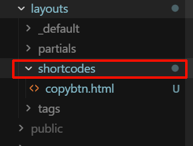

## 1. 为什么要封装 HTML？

在写博客时，很多时候我们会遇到这样的场景：

默认的 Markdown 格式无法满足排版或功能需求，比如想插入一个自定义样式的提示框、好看的标签或者一键复制的按钮。如果直接在文章里写 HTML，内容会变得很混乱，而且后续维护和复用都很不方便。

**Hugo 提供的 Shortcodes 功能，刚好就是为这种“写一次、处处复用”的场景准备的。**

这一篇就以“复制按钮”为例，演示如何在 `hugo-theme-stack` 项目里封装一个可复用的 HTML 组件。

## 2. Shortcodes 基础：放在哪、怎么命名？

Hugo 规则：**所有自定义 Shortcodes 都放在 `layouts/shortcodes/` 目录下**。

<a href="images/2026-03-03-16-35-08.png" target="_blank">  </a>

比如我想做一个点击按钮就能复制指定文字的组件，就可以这样操作：

- 新建文件：`layouts/shortcodes/copybtn.html`
- 之后在任意文章里，都可以通过以下格式调用组件：

```


```

**命名规则：**

- 文件名 `copybtn.html` → 调用名就是 `copybtn`
- 名称内不能带 `-` 以外的奇怪字符，建议全小写、用中划线或下划线分隔

## 3. 实战：封装一个“复制按钮”组件

### 3.1. 新建 Shortcode 文件

在项目根目录下新建（如果目录不存在就自己创建）：

```text
layouts/shortcodes/copybtn.html
```

<a href="images/2026-03-03-16-35-08.png" target="_blank">  </a>

填入下面这段代码：

```
<button
  type="button"
  class="copy-btn-shortcode"
  data-value="{{ .Get "value" }}"
  style="
    position: relative;
    display: inline-flex;
    align-items: center;
    gap: 8px;
    padding: 6px 12px;
    font-size: 14px;
    font-family: var(--font-family);
    color: var(--card-text-color-main);
    background-color: var(--card-background);
    border: 1px solid var(--card-separator-color);
    border-radius: var(--card-border-radius);
    cursor: pointer;
    transition: all 0.2s cubic-bezier(0.4, 0, 0.2, 1);
    user-select: none;
    box-shadow: var(--shadow-l1);
  "
  onmouseover="this.style.backgroundColor='var(--code-background)'; this.style.borderColor='var(--accent-color)';"
  onmouseout="this.style.backgroundColor='var(--card-background)'; this.style.borderColor='var(--card-separator-color)';"
  onmousedown="this.style.transform='scale(0.96)';"
  onmouseup="this.style.transform='scale(1)';"
  onclick="(function(btn){
    var text = btn.getAttribute('data-value');
    if (!text || btn.getAttribute('data-copying')) return;

    var saveToClipboard = function(str) {
      if (navigator.clipboard && navigator.clipboard.writeText) {
        return navigator.clipboard.writeText(str);
      } else {
        var el = document.createElement('textarea');
        el.value = str;
        document.body.appendChild(el);
        el.select();
        document.execCommand('copy');
        document.body.removeChild(el);
        return Promise.resolve();
      }
    };

    saveToClipboard(text).then(function () {
      btn.setAttribute('data-copying', 'true');
      var tip = document.createElement('span');
      tip.textContent = '已复制！';
      tip.style.cssText = 'position:absolute; top:-35px; left:50%; transform:translateX(-50%); background:var(--card-text-color-main); color:var(--body-background); font-size:12px; padding:4px 12px; border-radius:4px; white-space:nowrap; pointer-events:none; opacity:0; transition:all .3s ease; z-index:100; font-weight:bold; box-shadow: var(--shadow-l3); border: 1px solid var(--card-separator-color);';

      btn.appendChild(tip);
      setTimeout(function(){ tip.style.opacity = '1'; tip.style.top = '-42px'; }, 10);

      setTimeout(function () {
        tip.style.opacity = '0';
        setTimeout(function () { tip.remove(); btn.removeAttribute('data-copying'); }, 300);
      }, 1000);
    });
  })(this);"
>
  <svg width="14" height="14" viewBox="0 0 24 24" fill="none" stroke="currentColor" stroke-width="2" stroke-linecap="round" stroke-linejoin="round" style="opacity: 0.8;">
    <rect x="9" y="9" width="13" height="13" rx="2" ry="2"></rect>
    <path d="M5 15H4a2 2 0 0 1-2-2V4a2 2 0 0 1 2-2h9a2 2 0 0 1 2 2v1"></path>
  </svg>

  <span style="max-width: 260px; overflow: hidden; text-overflow: ellipsis; white-space: nowrap;">
    {{ .Get "label" | default (.Get "value") }}
  </span>
</button>

```

这里有几个重要点：

- **`.Get "value"`**：读取调用 Shortcode 时传入的 `value` 参数
- **`.Get "label"`**：展示在按钮上的文字，没传就回退到 `value`

> 你也可以根据自己的审美继续微调按钮样式，只要保证核心逻辑不变即可。

### 3.2. 在文章里调用复制按钮

在任何一篇文章的 `index.md` 中，你可以这样写：

```markdown
在下方的文本框里粘贴 
```

效果：

- 按钮显示为：
- 点击按钮：地址被复制到剪贴板，上方短暂出现“已复制！”的深色气泡提示

如果你想让按钮显示的内容和实际复制的内容不一样，例如显示一段更短的说明文字，可以加上 `label` 参数：

```markdown

```

这样：

- 
- **复制内容**：`https://api.deepseek.com/v1`
- **按钮文字**：`DeepSeek API 基础地址`

## 4. 在 hugo-theme-stack 中还能封装些什么？

`hugo-theme-stack` 本身已经有很好的排版和样式，但通过 Shortcodes，我们可以再往上加一层“写作小组件”，比如：

- **高亮提示块**：成功/警告/危险提示（例如 ``）
- **内嵌对比卡片**：对比两个工具、两种写法
- **代码运行按钮**：一键复制命令、打开外部 Playground 等

通用思路都是：

1. 在 `layouts/shortcodes/` 里写好 HTML + 少量 JS/CSS
2. 设计好几个易懂的参数（例如 `type`、`title`、`value`）
3. 在 Markdown 里用一行 ` ` 调用

当你发现自己**第三次**在文章里拷贝同一段 HTML 时，就可以考虑把它抽成一个 Shortcode 了。

## 5. 总结

- **Shortcodes 是 Hugo 自带的官方功能**，非常适合在 `hugo-theme-stack` 这种主题里封装常用的 HTML 组件。
- 把易错、冗长的 HTML + JS 抽成 Shortcode 后，写文章时只需要简单的一行 ```，既省时间，又方便后期统一调整样式。
- 你可以从本篇的复制按钮开始，逐步把自己常用的“套路组件”（提示框、按钮组、代码块说明等）都封装成 Shortcodes，让博客真正变成一个**为写作服务的系统**，而不是反过来被配置绑架。
