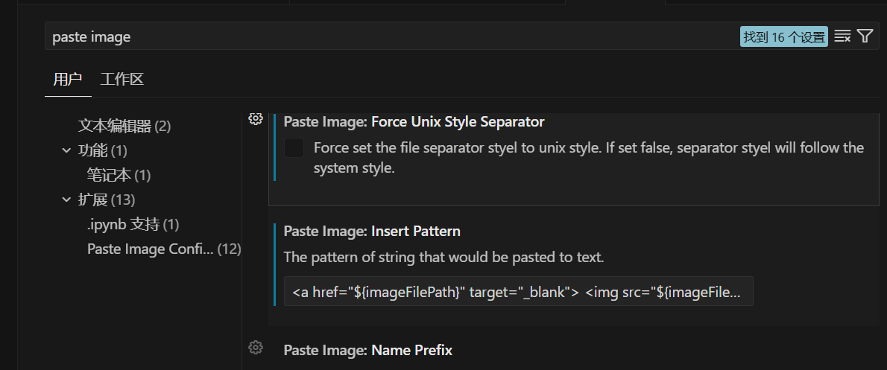
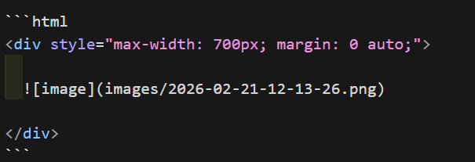
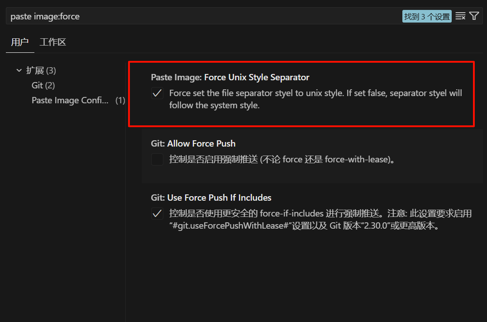

## 前言

> 本文基于 [hugo-theme-stack](https://github.com/CaiJimmy/hugo-theme-stack) 主题，其他主题的配置路径和渲染行为可能有所不同，请以各自主题的文档为准。

在使用 [Paste Image](https://marketplace.visualstudio.com/items?itemName=mushan.vscode-paste-image) 插件往文章里粘贴截图时，插件默认生成的 Markdown 语法如下：

```markdown

```

这种写法最简洁，hugo-theme-stack 也自带点击放大的交互效果。但它的缺点是**无法控制图片的显示尺寸**，当截图分辨率很高时，图片会撑满整个内容区域，视觉上较为突兀。

本文整理了两种可以控制图片显示尺寸的方案，各有优缺点，可以根据场景选择。

## 方案一：`<a>` + `` —— 点击另开标签页查看原图

### 写法

```html
<a href="images/2026-02-21-12-13-26.png" target="_blank">
  
</a>
```

通过 `width` 控制缩略图的最大显示宽度（单位 px），`max-width: 100%` 保证在小屏幕上不会溢出。

### 效果

- 缩略图**清晰**，直接展示原图缩放后的效果
- 点击图片后会在**新标签页**中打开原图，方便查看细节，关闭标签页即可返回

### 适合场景

- 图片内容细节丰富，需要让读者能放大查看（如截图、流程图、配置界面等）
- 希望缩略图尽量清晰

### 配合 Paste Image 自动生成

可以将 Paste Image 插件的 `Insert Pattern` 改为以下内容，之后粘贴截图时会自动生成方案一的格式，无需手动修改：

```

<a href="${imageFilePath}" target="_blank">

</a>

```

在 VS Code 中打开设置，搜索 `Paste Image: Insert Pattern`，将默认值替换为上方内容即可。

<a href="images/2026-02-21-14-31-22.png" target="_blank">  </a>

## 方案二：`<div>` 容器 + Markdown 图片 —— 通过容器控制宽度

### 写法

```html
<div style="max-width: 700px; margin: 0 auto;">
  
</div>
```

<br>

<a href="images/2026-02-21-14-43-56.png" target="_blank">  </a>

> 注意：`<div>` 标签与 `![image]` 之间必须有空行，这里的代码段因为 md 格式问题无法展现，记得自己加上空行，Hugo 才会正确将内部内容识别为 Markdown 并渲染。

### 效果

- 图片宽度跟随外层 `<div>` 的 `max-width` 决定，修改容器宽度即可调整图片大小
- `margin: 0 auto` 使图片居中显示
- 缩略图**略微模糊**，因为浏览器会对 Markdown 渲染出的 `` 进行拉伸或压缩

### 适合场景

- 需要将多张图片统一控制在相同宽度
- 希望保留主题自带的放大效果，同时能控制缩略图尺寸
- 希望图片居中且大小可控

### 注意事项

- 如果图片原始宽度比容器 `max-width` 小，图片会被拉伸放大，可能变模糊，建议 `max-width` 值不超过图片原始宽度
- 方案二**无法通过 Paste Image 自动生成**，需要在使用时手动将图片语法嵌套进 `<div>` 容器中
- **Windows 用户**：建议同时搜索 `Force Unix Style Separator` 并勾选，这样生成的路径会是正斜杠 `images/xxx.png`，网页中图片才能正常加载（否则会是反斜杠 `images\xxx.png`，可能 404）。 <a href="images/2026-02-22-13-37-30.png" target="_blank">  </a>

---

最后更新：2026-02-21
