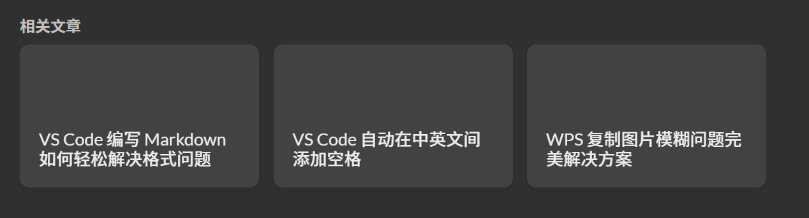
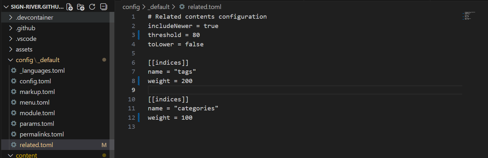

## 1. 问题背景

在使用 Hugo Theme Stack 主题搭建博客时，你可能会发现一个问题：文章底部的"相关文章"推荐有时候并不那么"相关"。

比如，一篇关于 **WPS 图片处理技巧**的文章，可能会被推荐到一篇讲 **Markdown 语法**的文章下方。虽然它们都属于"效率工具"分类，但实际上是完全不同领域的内容 —— WPS 是办公软件，Markdown 是写作语法，两者八竿子打不着。
<a href="images/2026-02-11-11-15-08.png" target="_blank">  </a>
这就是 Hugo 默认相关文章推荐配置带来的问题。

## 2. 默认配置分析

Hugo 的相关文章功能由 `config/_default/related.toml` 文件控制。让我们先看看默认配置：

```toml
# Related contents configuration
includeNewer = true
threshold = 60
toLower = false

[[indices]]
name = "tags"
weight = 100

[[indices]]
name = "categories"
weight = 200
```

### 2.1. 配置参数说明

#### 2.1.1. 全局配置参数

- **threshold（阈值）**：60
  - 相关性分数的阈值（范围 0-100）
  - 只有得分达到或超过 60 分的页面才会被推荐
  - ⚠️ 如果阈值设置过高，可能导致推荐内容过少甚至为空
  - 建议：内容较少的博客可以设置为 50-60，内容丰富的可以设置为 70-80

- **includeNewer**：true
  - 允许推荐比当前文章发布时间更晚的文章
  - 🔄 **动态特性**：当你发布新文章时，如果它与旧文章相关，会自动出现在旧文章的推荐列表中
  - 这意味着旧文章的推荐内容会随着新内容的发布而动态更新

- **toLower**：false
  - 在匹配时不将关键字转换为小写，保持区分大小写
  - 例如：标签 "Hugo" 和 "hugo" 会被视为不同的标签
  - 💡 建议设置为 `true` 可以产生更准确的匹配结果（虽会轻微影响性能）

#### 2.1.2. 索引与权重配置

- **tags（标签）**：权重 100
  - 使用文章 Front Matter 中的 `tags` 作为匹配依据
  - 在相似度计算中，标签匹配的重要性是 100

- **categories（分类）**：权重 200
  - 使用文章 Front Matter 中的 `categories` 作为匹配依据
  - 在相似度计算中，分类匹配的重要性是 200
  - **当前配置下，分类的重要性是标签的 2 倍**

### 2.2. Hugo 相似度算法说明

⚠️ **重要概念**：权重不是简单的加分机制！

Hugo 使用**加权相似度算法**来计算文章间的相关性：

1. 对于每个索引（tags 和 categories），Hugo 会计算两篇文章的**匹配度**
2. 将各索引的匹配度乘以对应的**权重**
3. 综合计算出一个 **0-100 的相似度分数**
4. 只有相似度 ≥ threshold 时才推荐

**关键点**：

- 权重的**比例**才是关键，不是绝对值
- categories 权重 200 vs tags 权重 100，意味着分类的重要性是标签的 **2 倍**
- 不是说"有一个相同分类就得 200 分"，而是说分类匹配对最终相似度的影响更大

**实际举例**：

- **文章 A**：与当前文章有相同的分类，但标签完全不同
- **文章 B**：与当前文章有相同的标签，但分类不同
- **结果**：文章 B 的得分会显著高于文章 A，因为它命中了权重更高的索引

**结合高阈值的影响**：

- 当 threshold = 80 时，仅靠 categories（权重较低）带来的匹配可能不足以达到 80 分
- 这套配置倾向于只推荐那些**标签高度重合**的文章，或者**同时在标签和分类上都有重合**的文章

### 2.3. 问题所在

在默认配置下，**分类的权重是标签的 2 倍**（200 vs 100），这导致：

- 分类匹配在相似度计算中占主导地位
- 所有标注为"效率工具"的文章，即使标签完全不同，也可能因为分类权重过高而被互相推荐
- 所有标注为"深度学习"的文章，即使具体方向不同（理论研究 vs 应用实践），也容易被判定为相关
- **宽泛的分类掩盖了标签的精确性**

## 3. 优化方案

### 3.1. 核心思路

我们需要**提高推荐标准**，让 Hugo 只推荐真正相似的文章。有两个调整方向：

1. **提高阈值**：让匹配要求更严格
2. **调整权重**：降低分类的重要性，提高标签的重要性

### 3.2. 推荐配置

打开 `config/_default/related.toml`，修改为以下内容：

```toml
# Related contents configuration
includeNewer = true
threshold = 80           # 从 60 提高到 80
toLower = false

[[indices]]
name = "tags"
weight = 200            # 从 100 提高到 200

[[indices]]
name = "categories"
weight = 100            # 从 200 降低到 100
```

### 3.3. 为什么这样改？

#### 3.3.1. 阈值提升（60 → 80）

更高的阈值意味着需要更高的相似度才能被推荐。

#### 3.3.2. 权重反转

- **标签权重提升（100 → 200）**
  - 标签通常更具体、更能代表文章的核心内容
  - 例如："PyTorch"、"WPS"、"Markdown" 这些标签直接指向具体技术
  - 提高权重后，标签匹配对相似度的影响更大

- **分类权重降低（200 → 100）**
  - 分类往往比较宽泛（如"效率工具"、"学习笔记"）
  - 降低权重后，仅凭分类相同不足以达到高相似度
  - 现在标签的重要性是分类的 2 倍（200:100）

## 4. 实施步骤

1. **打开配置文件**

   ```
   config/_default/related.toml
   ```

2. **修改配置**
   - 将 `threshold` 从 60 改为 80
   - 交换 `tags` 和 `categories` 的权重
     <a href="images/2026-02-11-11-12-42.png" target="_blank">  </a>
3. **保存并提交**
   - 如果使用 GitHub Pages，推送到仓库会自动部署
   - 如果本地测试，运行 `hugo server` 查看效果

4. **验证效果**
   - 打开博客的任意文章页面
   - 滚动到底部查看"相关文章"推荐
   - 检查推荐的文章是否更贴合主题

## 5. 总结

Hugo 的相关文章推荐功能非常强大，但默认配置对于内容多样化的博客来说不够精确。通过调整 `threshold`（阈值）和 `weight`（权重），我们可以让推荐结果更加智能。

希望这篇教程能帮助你打造一个更好的阅读体验！如果有任何问题，欢迎在评论区讨论。

## 6. 参考资料

- [Hugo Related Content 官方文档](https://gohugo.io/content-management/related/)
- [Stack 主题文档](https://stack.jimmycai.com/)
