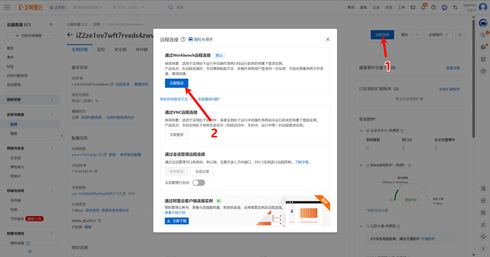
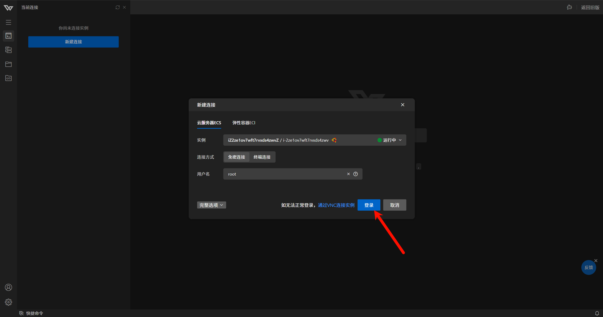

> <span style="font-size: 20px; font-weight: bold;">🚀 [点此回到上一界面](/p/stellaris-lan-openvpn-guide/)</span>

## 引言

**你需要准备**：

- 一台云服务器 (VPS)：本文以 **Ubuntu 24.04 64 位**系统为例
- 基础工具：**WindTerm**（SSH 终端，推荐）、**WinSCP**（用于传文件）
- 一颗折腾的心：虽然步骤较多，但为了流畅的银河征途，一切都是值得的！

## 服务器准备与基础环境搭建

俗话说"工欲善其事，必先利其器"。搭建群星联机节点，核心在于网络质量而非服务器的计算性能。本章将指导您完成服务器的选购及基础环境的配置。

### 服务器选购建议

在购买 VPS 时，请重点关注以下三点：

#### 带宽是核心

群星联机数据交换量较大。根据实测，**约 10Mbps 带宽**可支撑 **1～2 车人**（每车约 10 人）同时游玩，**带宽越大，后期卡顿概率越低**。

#### 地理位置

尽量选择距离您和朋友们地理位置都比较近的数据中心，以物理手段降低延迟。

#### 配置够用即可

如果这台服务器仅用于群星加速，CPU、内存和硬盘空间可以选最低配（如 1 核 1G），以降低成本。

### 安装必要组件

购买并登录服务器（使用 SSH 工具）后，我们需要安装解压工具和核心软件 OpenVPN。Ubuntu 24.04 的软件源已包含 OpenVPN，无需额外添加 EPEL。请依次执行以下指令：

#### 下载 SSH 客户端（推荐 WindTerm）

为方便操作，建议使用 **WindTerm** 作为 SSH 终端：免费、绿色免安装，解压即用，支持多标签与会话管理。

- **国内镜像下载（Windows 64 位便携版）**：  
  [WindTerm 2.7.0 便携版 (x86_64)](https://gitlink.org.cn/signriver/WindTerm/releases/download/2.7.0-Mirror/WindTerm_2.7.0_Windows_Portable_x86_64.zip)

下载后解压到任意目录，双击运行 `WindTerm.exe` 即可。

#### 使用 WindTerm 连接云服务器

1. 打开 WindTerm，点击 **「Session」→「New Session」** 或使用快捷键新建会话。
2. 选择 **SSH**，在 **Host** 中填写服务器公网 IP，**Port** 一般为 `22`（若云厂商使用其他端口请按实际填写）。
3. **Username** 填 `root`（或您的 SSH 用户名），认证方式选择 **Password** 并输入服务器密码；若使用密钥则选 **PublicKey** 并指定私钥路径。
4. 点击 **Connect** 连接。首次连接会提示确认主机指纹，选择接受即可。

连接成功后即可在终端中执行后续命令。下图为以阿里云为例的登录与连接示意。

<a href="images/2026-02-24-19-28-55.png" target="_blank">  </a>
<a href="images/2026-02-24-19-30-30.png" target="_blank">  </a>

#### 更新系统并安装所需软件

一次完成系统更新及 unzip、OpenVPN 的安装（解压服务端和运行 VPN 都需要）：

```bash
sudo apt update && sudo apt upgrade -y
sudo apt install -y unzip openvpn
```

<!-- [图片占位符：apt update 与安装结果] -->

#### 版本检查（重要！）

安装完成后，输入以下命令查看版本：

```bash
openvpn --version
```

<!-- [图片占位符：openvpn --version 输出] -->

⚠️ **请根据输出的版本号，记下您的情况**：

- **情况 A：版本 < 2.5**（例如 2.4.x）  
  与本教程提供的原始配置文件完全兼容，您在后续章节 **无需进行额外修改**。

- **情况 B：版本 ≥ 2.5**（2.5 或 2.6+）  
  **Ubuntu 24.04 默认安装的通常是 2.6.x**。新版本废弃了旧的加密与证书参数，在下一章部署时 **必须手动修改配置文件**（如 `data-ciphers none`、`verify-client-cert none`）才能正常连接，否则会导致无法联机。

### 开放防火墙端口（关键步骤）

为了让游戏数据能顺利进出服务器，我们需要开放两个特定的端口：**3074 (UDP)** 和 **3075 (TCP)**。这通常涉及两道关卡：**服务器内部防火墙**和**云厂商安全组**。

#### 第一关：服务器内部防火墙 (UFW)

Ubuntu 24.04 默认使用 **ufw** 作为防火墙前端。若未启用 ufw，端口默认可能未被限制；若已启用，需放行上述端口。

检查防火墙状态：

```bash
sudo ufw status
```

若显示 `Status: inactive`，说明防火墙未启用，可跳过本小节，直接配置 **云厂商安全组**。  
若显示 `Status: active`，请执行以下命令放行端口并重载。若尚未启用 ufw 但打算启用，可先执行 `sudo ufw enable`（提示时输入 y 确认），再执行下面的放行命令：

放行 3074 (UDP) 和 3075 (TCP)：

```bash
sudo ufw allow 3074/udp
sudo ufw allow 3075/tcp
sudo ufw reload
```

验证是否成功：

```bash
sudo ufw status numbered
```

<!-- [图片占位符：ufw 放行端口后的 list] -->

若在规则列表中看到 3074/udp 和 3075/tcp，即代表操作成功。

#### 第二关：云厂商安全组 (Security Group)

⚠️ **这是新手最容易忽略的一步！**

绝大多数云服务器（阿里云、腾讯云、华为云等）在网页控制台都有一层额外的 **「安全组」** 或 **「防火墙」** 设置。

请登录您的云服务器控制台，找到 **安全组 → 配置规则 → 手动添加**，填入以下信息：

<!-- [图片占位符：云厂商安全组规则入口] -->

规则 1 (UDP)

- 协议类型：UDP
- 端口范围：3074/3074
- 授权对象：0.0.0.0/0（所有 IP）
- 策略：允许

规则 2 (TCP)

- 协议类型：TCP
- 端口范围：3075/3075
- 授权对象：0.0.0.0/0（所有 IP）
- 策略：允许

<!-- [图片占位符：安全组 UDP/TCP 规则添加完成] -->

### 特殊情况：共享型 VPS 的端口转发（NAT 映射）

> ⚠️ **以下内容仅适用于购买了「超低价共享型 VPS」的用户，拥有独立公网 IP 的独立服务器用户可直接跳过本节。**

部分超低价 VPS 服务商并非给您一台独立的机器，而是**一台物理主机由多个用户共享**。在这种情况下，您拿到的并非一个独立的公网 IP，而是一个 **"IP:端口"** 的访问入口（例如 `160.202.254.14:10272`），其中 `10272` 是您的 SSH 登录端口。

在这种架构下，**3074 和 3075 端口由宿主机的主网关统一管理，您没有权限直接对外暴露这两个端口**，因此客户端无法通过标准端口直接连接到您服务器内的 OpenVPN 服务。

**解决方案：在服务商管理面板中配置端口转发（NAT 映射）**

您的 VPS 服务商通常会在其控制面板中提供端口转发功能，可以将宿主机上一个分配给您的外部端口，映射到您虚拟机内部的指定端口。

**操作步骤如下：**

1. 登录您的 VPS 服务商管理面板，找到您的实例
2. 找到 **端口转发（NAT / Port Forwarding）** 或类似选项
3. 添加两条转发规则（外部端口由系统分配或您自行填写）：

| 内部端口（本机 OpenVPN） | 协议 | 外部端口（映射后对外暴露） |
| :----------------------: | :--: | :------------------------: |
|           3074           | UDP  |         例：40074          |
|           3075           | TCP  |         例：40075          |

<!-- [图片占位符：端口转发/NAT 映射配置界面] -->

4. **记录下服务商分配给您的两个外部端口号**，在后续配置客户端时需要用到

> 💡 **注意**：内部防火墙（ufw）和云厂商安全组仍然需要开放 **3074（UDP）** 和 **3075（TCP）**，因为这是 OpenVPN 服务在您虚拟机内部实际监听的端口。端口转发规则是将外部流量"转进来"，服务本身不变。

## 服务端文件部署与核心配置

在第一章准备好环境后，我们需要将加速器的"心脏"——服务端核心文件部署到服务器中。这一步看似简单，但文件路径的准确性和脚本的执行权限直接决定了后续服务能否启动。

首先，我们需要先从 [原作者博客](https://www.dogfight360.com/blog/1590/#comment-41142) 中下载关键文件 [教程 .zip](https://www.dogfight360.com/blog/wp-content/uploads/2021/07/%E6%95%99%E7%A8%8B.zip), 解压后从中提取出 server.zip

### 使用 WinSCP 上传文件

为了方便管理，我们推荐使用 [WinSCP 可视化工具](https://winscp.net/eng/download.php) 将文件上传到服务器的临时目录。

#### 建立连接

1. 打开 WinSCP 软件。
2. **主机名**：填写您的服务器公网 IP。
3. **用户名**：root（若使用 sudo 用户登录，填该用户名即可）。
4. **密码**：您的服务器 SSH 登录密码。

   <!-- [图片占位符：WinSCP 登录界面] -->

5. 点击登录，如果是首次连接，点击"是"接受密钥指纹。

   <!-- [图片占位符：接受主机密钥] -->

#### 上传操作

1. 登录成功后，软件界面左侧代表您的电脑，右侧代表服务器。
2. 在右侧（服务器端），双击顶部的 `..` 文件夹图标返回根目录，然后找到并进入 `/tmp` 目录。
   （选择 `/tmp` 是因为它是存放临时文件的标准位置，系统重启后会自动清理，适合做中转）

   <!-- [图片占位符：进入 /tmp 目录] -->

3. 在左侧（本地端），找到您电脑上的 `server.zip` 文件。
4. 将 `server.zip` 直接拖拽到右侧窗口中。

   <!-- [图片占位符：拖拽上传 server.zip] -->
   <!-- [图片占位符：上传进度/完成] -->

### 解压与部署

文件上传完成后，我们需要通过 SSH 终端将其解压到 OpenVPN 的标准配置目录中。

#### 创建标准目录

为了规范化管理，我们统一将文件存放在 `/etc/openvpn` 目录下。输入以下命令创建目录（如果系统已自动创建，此命令会提示已存在，忽略即可）：

```bash
sudo mkdir -p /etc/openvpn
```

#### 解压文件

输入以下命令，将刚才上传到临时目录的文件解压到配置目录：

```bash
sudo unzip /tmp/server.zip -d /etc/openvpn/
```

#### 验证解压结果

解压完成后，我们要确认文件是否都在。输入以下命令查看目录内容：

```bash
ls -l /etc/openvpn/
```

请仔细核对输出结果，确保目录下包含以下关键文件：

- `server_tcp.conf` （TCP 配置文件）
- `server_udp.conf`（UDP 配置文件）
- `checkpsw.sh` （密码验证脚本）
- `psw-file` （账号密码文件）

### 关键步骤：赋予执行权限

⚠️ **这是最容易被新手忽略的一步！**

`checkpsw.sh` 是一个 Shell 脚本，OpenVPN 需要调用它来验证客户端传来的账号密码。如果它没有 **「可执行权限」**，服务器就会 **拒绝所有连接请求**，导致报错。

#### 赋予权限

输入以下命令，将脚本标记为可执行文件：

```bash
sudo chmod +x /etc/openvpn/checkpsw.sh
```

#### 再次验证

再次输入查看命令：

```bash
ls -l /etc/openvpn/checkpsw.sh
```

观察输出结果的第一个字段：

- 如果显示 `-rwxr-xr-x` （包含 `x` 且文件名通常变绿），说明权限设置成功。
- 如果显示 `-rw-r--r--` （没有 `x`)，说明失败，请重新执行 `chmod` 命令。

---

至此，所有的文件都已就位，且具备了运行条件。下一章我们将进入最核心、也最复杂的环节：修改配置文件以适配群星的低延迟需求及新版系统的兼容性。

## 核心配置与版本兼容性修正

文件部署完成后，我们需要对 OpenVPN 的配置文件进行"手术"。本章的核心目标是：关闭加密以降低延迟，并修正新旧版本的语法差异。

### 修改 TCP 配置文件

首先修改 TCP 协议的配置文件。此文件决定了游戏数据的传输方式之一。

#### 打开 tcp 文件

使用编辑器打开 server_tcp.conf（任选其一）：

```bash
sudo vi /etc/openvpn/server_tcp.conf
# 若不熟悉 vi，可用 nano：sudo nano /etc/openvpn/server_tcp.conf（保存：Ctrl+O 回车，退出：Ctrl+X）
```

<!-- [图片占位符：编辑 server_tcp.conf] -->

#### 编辑 tcp 指南

进入编辑模式（按 i 键），请根据您的 OpenVPN 版本进行以下修改：

1. 针对 OpenVPN 2.4.x（旧版）
   保持以下参数不变（如果文件中是这样写的）：

```text
cipher none
client-cert-not-required
```

2. 针对 OpenVPN 2.5.x（较新版）
   旧的 cipher 指令已弃用，请找到 cipher none，将其修改或替换为：

```text
data-ciphers none
```

（如果不改，服务端日志会疯狂报错提示协商失败）

<!-- [图片占位符：data-ciphers 修改示意] -->

3. 针对 OpenVPN 2.6.x（最新版）
   除了执行上述 2.5.x 的修改外，还必须处理证书验证指令。
   找到 client-cert-not-required，将其**删除**并替换为：

```text
verify-client-cert none
```

（新版本彻底移除了旧指令，不替换将无法启动服务）

<!-- [图片占位符：verify-client-cert 修改示意] -->

#### 保存 tcp 并退出

vi：按 Esc，输入 `:wq` 回车。nano：Ctrl+O 回车保存，Ctrl+X 退出。

### 修改 UDP 配置文件

接下来修改 UDP 配置文件，通常群星联机更推荐使用 UDP 协议，因为它的延迟更低。

#### 打开 udp 文件

```bash
sudo vi /etc/openvpn/server_udp.conf
# 或使用 nano：sudo nano /etc/openvpn/server_udp.conf
```

#### 编辑 udp 指南

操作逻辑与 TCP 完全一致，请重复上述步骤：

1. 通用修改
   将 auth 改为 auth none。

2. 版本适配

- 2.4.x：保持 cipher none 和 client-cert-not-required。

- 2.5.x：将 cipher 改为 data-ciphers none。
- 2.6.x：同上，并将 client-cert-not-required 替换为 verify-client-cert none。

#### 保存 udp 文件并退出

vi：按 Esc，输入 `:wq` 回车。nano：Ctrl+O 回车保存，Ctrl+X 退出。

### 设置连接账号密码

最后，我们需要配置 checkpsw.sh 脚本读取的账号密码文件。客户端连接时必须填写这里设置的内容。

#### 打开密码文件

```bash
sudo vi /etc/openvpn/psw-file
# 或：sudo nano /etc/openvpn/psw-file
```

#### 设置账号

文件内容的格式非常简单：用户名 空格 密码。
您可以删除原有的默认内容，填入您自己的账号。

示例（设置用户名为 stellaris，密码为 123456）：

```text
stellaris 123456
```

#### 保存退出

vi：Esc → `:wq` 回车。nano：Ctrl+O 回车，Ctrl+X。

> **可选（熟悉命令行时）**：若 OpenVPN 为 2.6.x，可用 sed 批量替换 cipher 与证书参数，再用编辑器确认并补上 `auth none`：

```bash
sudo sed -i 's/cipher none/data-ciphers none/g; s/client-cert-not-required/verify-client-cert none/g' /etc/openvpn/server_tcp.conf /etc/openvpn/server_udp.conf
```

---

至此，配置文件的修改工作全部完成。下一章我们将尝试启动服务，并教您如何看懂启动日志来验证修改是否成功。

## 服务启动验证与自动化部署

配置文件的修改只是纸上谈兵，我们需要通过实际运行来验证服务能否启动。如果配置文件有语法错误（例如 OpenVPN 版本不兼容），在这一步就会暴露出来。确认无误后，我们将配置开机自启。

### 手动启动测试

在后台静默运行之前，我们先在前台手动启动一次，以便直观地看到启动日志。

#### 测试 TCP 服务

在 Ubuntu 中 OpenVPN 一般位于 `/usr/sbin/openvpn`（不确定可执行 `which openvpn` 查看）。直接启动 TCP 服务端：

```bash
sudo /usr/sbin/openvpn --cd /etc/openvpn/ --config server_tcp.conf
```

<!-- [图片占位符：TCP 服务启动日志] -->

#### 观察启动日志

终端会输出一长串日志。请耐心观察最后一行：

- ✅ 如果显示 **`Initialization Sequence Completed`**，说明 TCP 服务启动成功，配置文件无误。
- ❌ 如果显示 **`Exiting due to fatal error`** 或其他报错，请仔细检查报错信息（通常是 `cipher` 或 `auth` 参数写错了），并返回上一章重新修改。

确认成功后，按 `Ctrl + C` 停止服务。

#### 测试 UDP 服务

重复上述步骤，测试 UDP 配置文件：

```bash
sudo /usr/sbin/openvpn --cd /etc/openvpn/ --config server_udp.conf
```

<!-- [图片占位符：UDP 服务启动日志] -->

同样等待出现 **`Initialization Sequence Completed`** 后，按 `Ctrl + C` 停止。

### 配置开机自启动

为了让加速器在服务器重启后自动运行，我们使用 **systemd** 创建两个服务单元。Ubuntu 24.04 默认使用 systemd，无需依赖 rc.local。

#### 创建 TCP 服务单元

```bash
sudo tee /etc/systemd/system/openvpn-stellaris-tcp.service << 'EOF'
[Unit]
Description=OpenVPN Stellaris TCP
After=network.target

[Service]
Type=simple
ExecStart=/usr/sbin/openvpn --cd /etc/openvpn/ --config server_tcp.conf
Restart=on-failure

[Install]
WantedBy=multi-user.target
EOF
```

#### 创建 UDP 服务单元

```bash
sudo tee /etc/systemd/system/openvpn-stellaris-udp.service << 'EOF'
[Unit]
Description=OpenVPN Stellaris UDP
After=network.target

[Service]
Type=simple
ExecStart=/usr/sbin/openvpn --cd /etc/openvpn/ --config server_udp.conf
Restart=on-failure

[Install]
WantedBy=multi-user.target
EOF
```

#### 启用并启动服务

```bash
sudo systemctl daemon-reload
sudo systemctl enable openvpn-stellaris-tcp openvpn-stellaris-udp
sudo systemctl start openvpn-stellaris-tcp openvpn-stellaris-udp
```

<!-- [图片占位符：systemctl enable/start 执行结果] -->

检查状态（应均为 active (running)）：

```bash
sudo systemctl status openvpn-stellaris-tcp openvpn-stellaris-udp
```

### 可选：重启验证

若想确认开机自启是否生效，可重启服务器后再检查端口（非必须，上面 `systemctl status` 正常即可）。

#### 重启服务器

```bash
sudo reboot
```

SSH 会断开，等待 1～2 分钟后重新连接。

#### 验证端口监听状态

重新连接后执行：

```bash
ss -ulnp | grep 3074
ss -tlnp | grep 3075
```

（Ubuntu 默认未安装 `netstat`，使用 `ss` 查看端口；若已安装 net-tools，也可用 `netstat -anp | grep 307`。）

<!-- [图片占位符：端口监听检查结果] -->

#### 确认结果

观察输出结果：

- 若 UDP 3074 和 TCP 3075 均有对应进程在监听，说明加速器已成功在后台自动运行，服务端部署完成。

## 客户端深度配置与联机实测

服务端配置圆满结束后，最后一步就是配置玩家手中的客户端。本方案使用的是 **UsbEAm LAN Party**，它小巧免安装，通过 TAP 虚拟网卡技术组建虚拟局域网，非常适合群星这种 P2P 联机游戏。

### 下载与安装

我们需要准备客户端程序和虚拟网卡驱动。

#### 获取软件

请前往原作者 Dogfight360 的博客下载最新版客户端（通常名为 UsbEAm_LAN_Party_V1.x.zip）：

> <https://www.dogfight360.com/blog/1590/>

<!-- [图片占位符：下载页面/解压后的文件列表] -->

解压后，您应该会看到以下三个核心文件：

- UsbEAm LAN Party V1.2.exe（客户端主程序）
- tap-windows-9.9.2_3.exe（虚拟网卡驱动安装包）
- customize.ini（节点配置文件）

#### 安装 TAP 驱动

如果是第一次使用该软件，必须安装 TAP 驱动，否则无法建立虚拟局域网。

1. 双击运行 tap-windows-9.9.2_3.exe。
2. 一路点击 Next（下一步）直到安装完成。
3. 注意：安装过程中无需更改任何默认设置。

   <!-- [图片占位符：TAP 驱动安装完成] -->

### 配置节点信息

我们需要修改 customize.ini 文件，将我们服务器的信息填进去，让客户端知道去哪里连接。

#### 编辑配置文件

用记事本打开 customize.ini，清空里面的内容，或者直接修改为以下标准格式：

<!-- [图片占位符：customize.ini 编辑] -->

```ini
[usbeam]
Server List=我的群星节点
Disable rules=0
Broadcast fix=0

[我的群星节点]
IP=203.0.113.1
TCP Port=3075
UDP Port=3074
USER=stellaris
PASS=123456
```

#### 参数详解（请务必核对）

- **Server List**：这里填的名字会显示在软件下拉菜单里
- **[我的群星节点]**：中括号里的名字必须与 `Server List` 保持一致
- **IP**：改为您服务器的 **公网 IP**（示例中的 203.0.113.1 仅为占位）。若为共享型 VPS，只填 IP，不要带端口号。
- **TCP Port / UDP Port**：默认填写 `3075` 和 `3074`。**如果您使用的是共享型 VPS**，请填写您在服务商管理面板中配置的端口转发规则里对应的**外部端口号**（详见上方"特殊情况：共享型 VPS 的端口转发"一节）
- **USER**：修改为您在 `psw-file` 里设置的 **用户名**
- **PASS**：修改为您在 `psw-file` 里设置的 **密码**
- **Disable rules=0**：代表默认不勾选「不使用安全规则」
- **Broadcast fix=0**：代表默认不勾选「修正广播优先级」

修改完成后，保存并关闭文件。

### 启动连接与测试

万事俱备，只欠东风。

#### 启动客户端

双击运行 UsbEAm LAN Party V1.2.exe。

<!-- [图片占位符：客户端主界面] -->

#### 选择节点

在软件界面的下拉框中，找到我们刚才在配置文件里命名的节点（例如"我的群星节点"）。

#### 选择模式（关键！）

在连接按钮的左侧或下方，通常有模式选择。  
⚠️ **请务必勾选 UDP 模式**。

> 💡 群星联机对延迟极其敏感，**UDP 模式去除了 TCP 的握手重传机制**，能显著降低延迟，是本教程的核心优势所在。

<!-- [图片占位符：选择 UDP 模式] -->

#### 点击连接

点击 **连接** 按钮。

- 观察软件底部的状态栏
- ✅ 如果显示 **「连接状态：正常 (xx ms)」**，恭喜您！节点搭建成功
- ❌ 如果一直卡在「正在连接」或提示 **验证失败**，请检查：
  - 防火墙端口是否正确开放（第一章）
  - 账号密码是否填写正确（上一章）
  - 服务端是否正常运行

<!-- [图片占位符：连接状态正常] -->

当所有小伙伴都显示 **「连接状态：正常」** 后，大家实际上已经处于同一个虚拟局域网中。

<!-- [图片占位符：多人连接成功] -->

## 总结

🎉 至此，您的专属群星联机加速节点已部署完毕！

**使用方法**：

1. 所有玩家启动 UsbEAm LAN Party 客户端
2. 连接到同一节点
3. 确认状态显示「正常」
4. 直接进入游戏，享受低延迟的联机体验！

祝各位征途愉快！🚀
